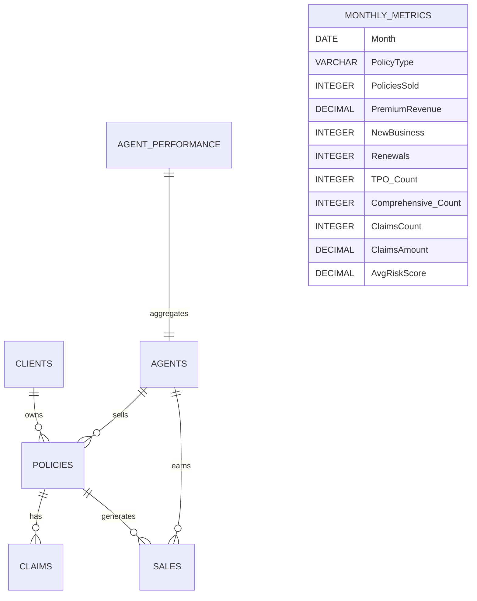

# SQL Schema & Data Cleaning

## 1. Schema Design
The database was designed to capture the core insurance business processes. It consists of 7 tables that represent clients, agents, policies, claims, sales, performance, and monthly metrics.

### Core Entities
clients → Customer demographic and profile information.
agents → Sales agents and their attributes.
policies → Policies purchased by clients, linked to agents.
claims → Claims raised against policies.
sales → Commission and transaction details for policy sales.
agent_performance → Aggregated agent KPIs.
monthly_metrics → Aggregated metrics for reporting and trend analysis.

### Relationships
Each policy is tied to a client and an agent.
Each claim belongs to a policy.
Each sale belongs to a policy and an agent.
agent_performance and monthly_metrics are derived/aggregated tables for reporting purposes.

### Schema Design Principles:
**Normalization**: Core transactional tables (clients, policies, claims, sales) are normalized to reduce redundancy.
**Referential Integrity**: Foreign key relationships ensure no orphaned records (e.g., sales without policies).
**Separation of raw vs. derived**: Aggregated metrics live in separate tables (agent_performance, monthly_metrics).
**Scalability**: The schema allows new policy types, claim types, and sales channels to be added with minimal changes.

## 2. Data Quality Checks
After loading the data, we validate its integrity with SQL checks:

- Row Counts
```SQL
SELECT 'agent_performance' AS table_name, COUNT(*) AS rows FROM agent_performance
UNION ALL
SELECT 'agents', COUNT(*) FROM agents
UNION ALL
SELECT 'claims', COUNT(*) FROM claims
UNION ALL
SELECT 'clients', COUNT(*) FROM clients
UNION ALL
SELECT 'monthly_metrics', COUNT(*) FROM monthly_metrics
UNION ALL
SELECT 'policies', COUNT(*) FROM policies
UNION ALL
SELECT 'sales', COUNT(*) FROM sales;
```

### Referential Integrity
- Policies without clients
- Sales without policies
- Claims without policies

### Categorical Consistency
- Check for typos/duplicates in Status, Gender, ClaimStatus, Channel.
- Example: Actiev instead of Active in policies.Status.

### Null Analysis
- Gender in clients → <1% missing.
- Channel in policies → <1% missing.
- Spread of nulls across RiskProfile and Tier.

### Duplicate Analysis
- 10 duplicate clients.
- 50 duplicate policies.
- Some duplicate sales entries.

## 3. Data Cleaning Steps
The following queries are applied to fix quality issues:

### Remove Duplicate Records

```SQL
DELETE FROM clients 
WHERE ctid NOT IN (
  SELECT MIN(ctid) FROM clients GROUP BY clientid
);

DELETE FROM policies
WHERE ctid NOT IN (
  SELECT MIN(ctid) FROM policies GROUP BY policyid
);
```


### Fix Typos in Status
```SQL
UPDATE policies
SET Status = 'Active'
WHERE Status = 'Actiev';
```

### Handle Nulls
```SQL
UPDATE clients
SET gender = 'Unknown'
WHERE gender IS NULL;

UPDATE policies
SET channel = 'Unknown'
WHERE channel IS NULL;
```

