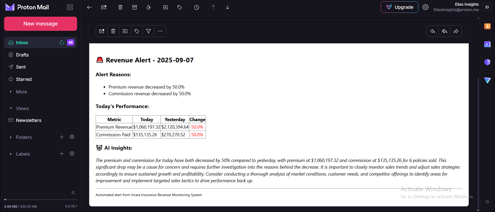

# 📡 Monitoring & Alert System

## Overview
This module continuously monitors insurance revenues (premiums & commissions) and automatically sends alerts when significant fluctuations occur. It combines database queries, AI-powered summaries, and email notifications to keep stakeholders updated in real time.

**The goal is to help SACCOs and insurers proactively detect anomalies in daily performance — without manual monitoring.**

## ✨ Key Features

- Automated Monitoring: Pulls premium & commission data directly from PostgreSQL.
- Change Detection: Calculates % changes against yesterday’s performance.
- Configurable Thresholds: Triggers alerts if changes exceed ±10% (default).
- AI Insights: Uses GPT to generate concise, executive-style summaries.
- Email Alerts: Sends HTML reports with key metrics, comparisons, and insights.
- Debug-Friendly: Includes logging, error handling, and crash-safe debugging.

## ⚙️ Tech Stack
- Python (automation & orchestration)
- PostgreSQL + SQLAlchemy (data queries)
- pandas (data analysis)
- SMTP (Gmail) (email delivery)
- OpenAI API (AI-powered summaries)
- dotenv (secure configuration via .env file)

## 🔑 Configuration
Environment variables are loaded from a project-level .env file. Required keys:

### Database
- DB_USER=your_user
- DB_PASS=your_password
- DB_HOST=localhost
- DB_PORT=5432
- DB_NAME=insurance_db

### Email (SMTP)
- SMTP_USER=your_email@gmail.com
- SMTP_PASS=your_app_password
- CEO_EMAIL=recipient@company.com

### OpenAI
- OPENAI_API_KEY=sk-xxxxxxxxxxxxxxxx

If any variable is missing, the system will fail fast with a clear error message.

## 📊 How It Works
- Fetch Data
- Queries yesterday & today’s revenues from policies (premiums) and sales (commissions).
- Analyze Trends
- Computes absolute & percentage changes.
- Flags anomalies if changes exceed threshold.
- Generate Insights
- If flagged, calls OpenAI to summarize changes.
- Produces 2–3 actionable, executive-style insights.
- Send Alerts
    - Sends an HTML-formatted email to stakeholders.
    -Includes tables, highlights, and AI commentary.
- Fail-Safe Mode
    - If email is misconfigured, results are printed to console.
    - If crash occurs, debugger (pdb) is invoked automatically.

## 📧 Example Alert (Email Output)

## ▶️ Usage
Run the monitor directly:
- python monitoring_alert_system.py
- If no alerts are triggered → logs summary only.
- If alerts are triggered → sends email + AI insights.